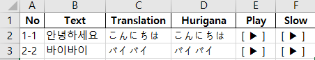

# bilingual-kr-jp-dict-audio

- input
 
| No | Text |
| :---: | :---: |
| 1-1 | 안녕하세요 | 
| 1-2 | 바이바이 | 
 
 [sample-input](./data/sample-input.xlsx)
 
 

- output
 
 translation / pronunciation (hurigana) / audio (normal / 0.7x slow down)
 
 
